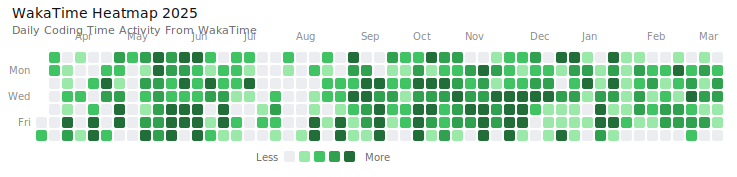

 <h1 align="center">Hi 👋, I'm Ardya Pusaka also A.K.A "Kizaru Zero"</h1>
<h3 align="center">A passionate Fullstack Web Developer From Indonesia</h3>

- 🌱 I’m currently learning **Golang,React and C#**

- 📫 How to reach me **ardyapusaka@gmail.com**

- 📄 Know about my experiences [https://www.linkedin.com/in/ardya-pusaka-74a873303/](https://www.linkedin.com/in/ardya-pusaka-74a873303/)

- ⚡ Fun fact **I Dont Like Coffe**

<h3 align="left">Connect with me:</h3>
<p align="left">
<a href="https://www.linkedin.com/in/ardya-pusaka/" target="blank"></a>
<a href="https://fb.com/ardya" target="blank"></a>
<a href="https://instagram.com/ardyavnx" target="blank"></a>
</p>

<p>&nbsp;</p>

<p></p>

<!--START_SECTION:waka-->


**🐱 My GitHub Data** 

> 📦 458.6 kB Used in GitHub's Storage 
 > 
> 🏆 321 Contributions in the Year 2025
 > 
> 🚫 Not Opted to Hire
 > 
> 📜 24 Public Repositories 
 > 
> 🔑 42 Private Repositories 
 > 
**I'm an Early 🐤** 

```text
🌞 Morning                140 commits         ████░░░░░░░░░░░░░░░░░░░░░   17.43 % 
🌆 Daytime                273 commits         ████████░░░░░░░░░░░░░░░░░   34.00 % 
🌃 Evening                322 commits         ██████████░░░░░░░░░░░░░░░   40.10 % 
🌙 Night                  68 commits          ██░░░░░░░░░░░░░░░░░░░░░░░   08.47 % 
```
📅 **I'm Most Productive on Saturday** 

```text
Monday                   127 commits         ████░░░░░░░░░░░░░░░░░░░░░   15.82 % 
Tuesday                  94 commits          ███░░░░░░░░░░░░░░░░░░░░░░   11.71 % 
Wednesday                123 commits         ████░░░░░░░░░░░░░░░░░░░░░   15.32 % 
Thursday                 105 commits         ███░░░░░░░░░░░░░░░░░░░░░░   13.08 % 
Friday                   116 commits         ████░░░░░░░░░░░░░░░░░░░░░   14.45 % 
Saturday                 134 commits         ████░░░░░░░░░░░░░░░░░░░░░   16.69 % 
Sunday                   104 commits         ███░░░░░░░░░░░░░░░░░░░░░░   12.95 % 
```


📊 **This Week I Spent My Time On** 

```text
🕑︎ Time Zone: Asia/Jakarta

💬 Programming Languages: 
C#                       7 hrs 44 mins       ███████████████░░░░░░░░░░   61.61 % 
Binary                   3 hrs 2 mins        ██████░░░░░░░░░░░░░░░░░░░   24.19 % 
JavaScript               1 hr 4 mins         ██░░░░░░░░░░░░░░░░░░░░░░░   08.52 % 
HTML                     29 mins             █░░░░░░░░░░░░░░░░░░░░░░░░   03.95 % 
PHP                      12 mins             ░░░░░░░░░░░░░░░░░░░░░░░░░   01.69 % 

🔥 Editors: 
Cursor                   9 hrs 16 mins       ██████████████████░░░░░░░   73.76 % 
Visual Studio            3 hrs 17 mins       ███████░░░░░░░░░░░░░░░░░░   26.24 % 

🐱‍💻 Projects: 
trakindo-eprocurement    10 hrs 36 mins      █████████████████████░░░░   84.35 % 
EprocurementApp          1 hr 45 mins        ███░░░░░░░░░░░░░░░░░░░░░░   13.94 % 
Harvestly                12 mins             ░░░░░░░░░░░░░░░░░░░░░░░░░   01.71 % 

💻 Operating System: 
Windows                  12 hrs 34 mins      █████████████████████████   100.00 % 
```


 Last Updated on 20/12/2025 08:54:59 UTC
<!--END_SECTION:waka-->

## WakaTime Yearly Heatmap




